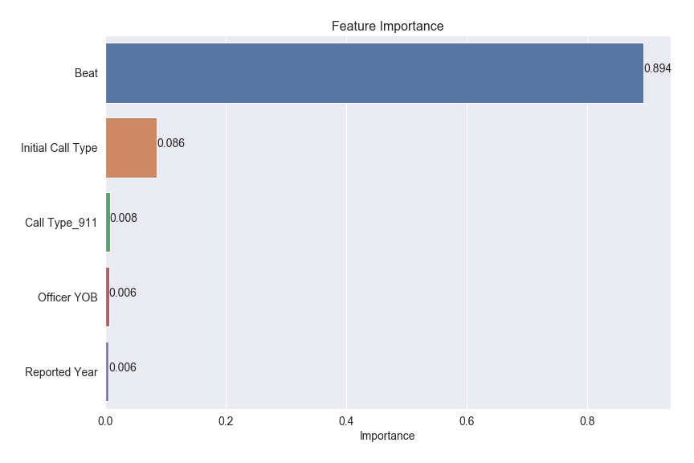

# Terry Stops in Seattle: Predicting Arrests as a Result of a Terry Stop

This project involves an iterative approach to building a classification model to predict arrests as a result of Terry Stops, utilizing Terry Stop data in Seattle, WA, with reports starting in 2015. The description of the data is pulled directly from https://www.seattle.gov/police/information-and-data/terry-stops and is as follows: "[The data includes] police-civilian contacts that involve the stop and limited detention of an individual (Terry stop). Under Terry v. Ohio, 392 U.S. 1 (1968), such contacts authorized under law and policy for purposes of investigating, based on an officer's reasonable suspicion, whether the individual is engaging, has engaged, or is about to engage in criminal activity.   During the course of a Terry stop, an officer may develop probable cause to effect an arrest, but probable cause is not required to make the initial stop, nor does a stop that is based on probable cause to arrest fall within the category of a Terry stop."

The project follows the OSEMN approach as outlined below:

### 1. Obtain Data

The data for this project was obtained directly from https://catalog.data.gov/dataset/terry-stops, downloaded as a csv file and imported into a pandas dataframe. The column descriptions are available in the github repo for this project as an md file.

### 2. Scrub Data

Scrubbing the data involved removing duplicate records, filling missing values, determining whether to keep or replace placeholder values, and converting to appropriate data types.

### 3. Explore Data

This step involved plotting all features vs. the target variable, Stop Resolution, to perform additional, necessary feature engineering, one hot encoding categorical variables, and getting an overall understanding of which features to include to begin the modeling process.

### 4. Model Data

The modeling approach was to utilize several different classification algorithms and compare scores, then implementing the Boruta algorithm for feature selection, and utilizing GridSearchCV with hyperparameter tuning to increase our score. The focus on this project was the recall score (measuring the proportion of positives that are correctly identified), with the ultimate goal of predicting arrests while minimizing false negatives.

The algorithms used are as follows: Logistic Regression, Multinomial Bayes, Decision Trees, Random Forest, Balanced Random Forest, Bagging with Decision Trees, Balanced Bagging with Decision Trees, AdaBoost, and XGBoost.

### 5. Interpreting Data

The final model was built with the XGBoost algorithm, using features selected from the Boruta algorithm and fitting our model with hyperparameter tuning. The interpretation of our model is found in the conclusion section of this notebook, and following that, a function was built to test our model.

# Conclusion: Interpreting our Final Model

Using features selected from the Boruta algorithm and fitting our model with the XGBoost algorithm with hyperparameter tuning, our model result has a recall score of 95.5% while maintaining approximately 50% accuracy overall for both train and test data. Ultimately, our goal was to focus on recall and predict the highest amount of arrests along with minimizing false negatives, while at the same time maintaining an accuracy above 50%. This result could potentially contribute to reducing the amount of unecessary Terry Stops. Further investigation could include making this a multi-classification problem and predicting whether the result of the Terry Stop was an arrest, offense report, citation/infraction, the suspect was referred for prosecution, or just field contact. Additionally, one could investigate if race and gender have a significant impact on whether a suspect is arrested or not. The final features determining our model results are below with Beat being our feature with the highest importance.

- Beat (whether the address associated with the underlying Computer Aided Dispatch (CAD) event was reported or not)
- Initial Call Type (whether an initial call type was reported or not)
- Call Type_911 (call received by the communication center by dialing 911)
- Officer YOB
- Reported Year

